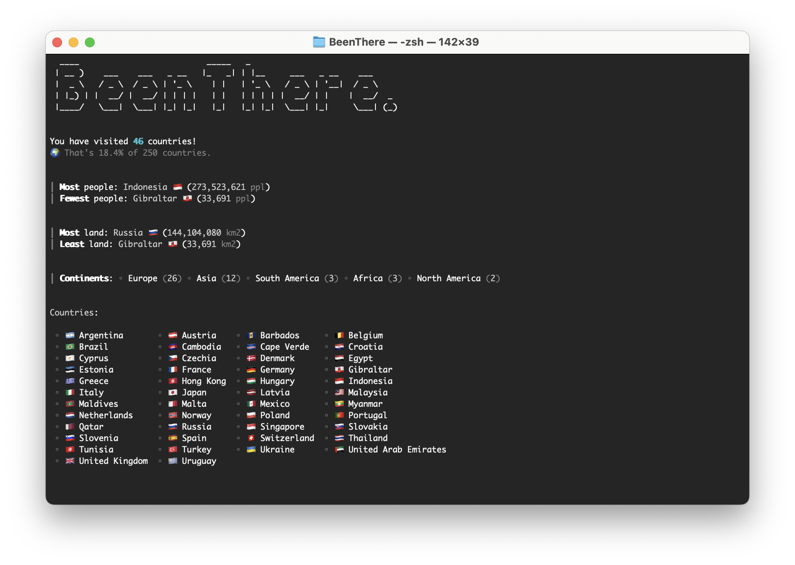
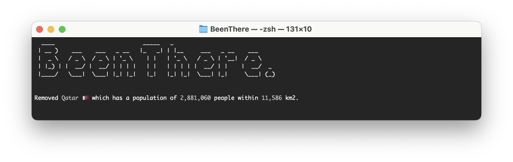
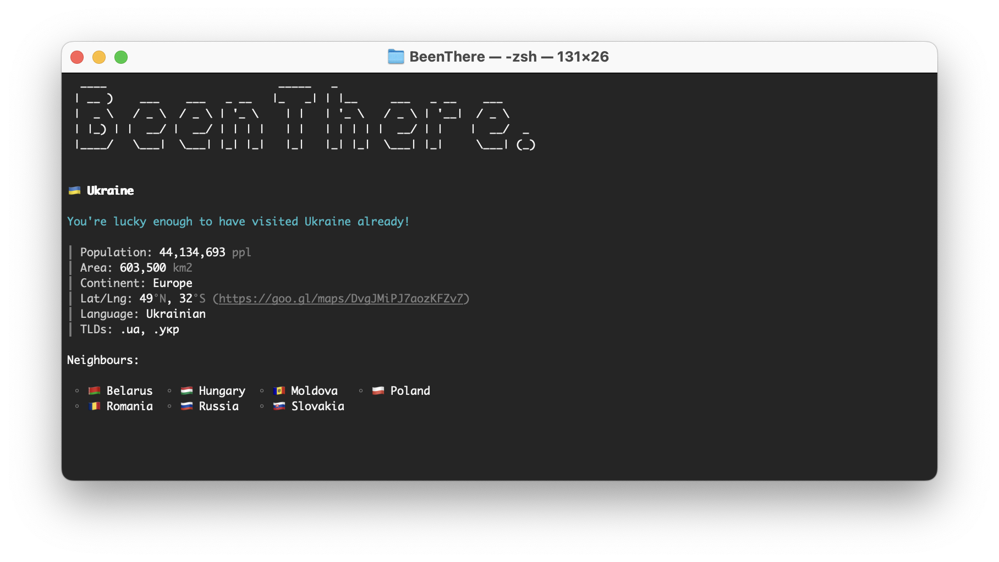
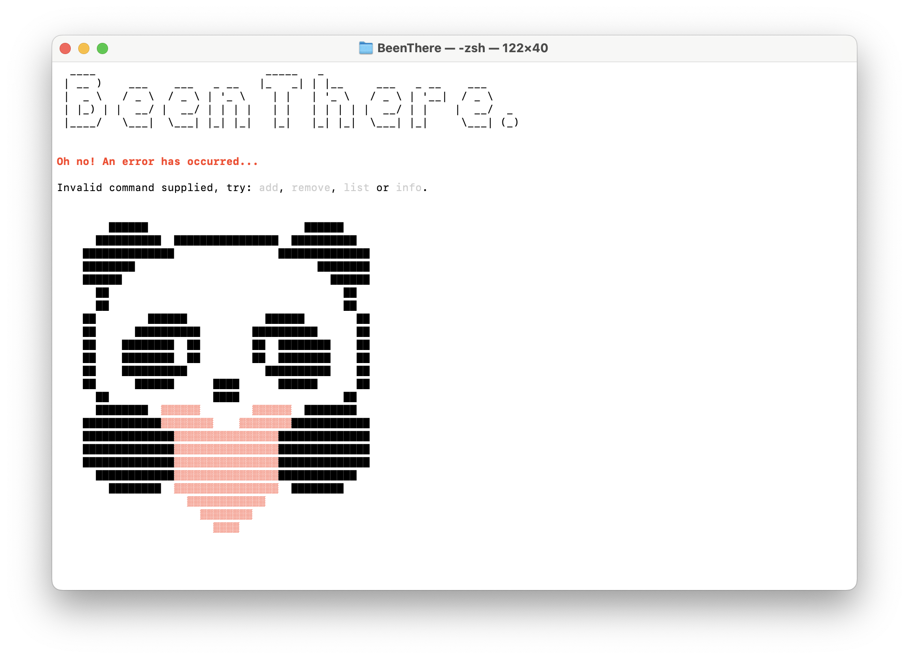

# BeenThere

> Terminal application for listing the countries you've visited with other interesting statistics thrown in




## Installation

### Homebrew (macOS & Linux)

```console
foo@bar:~$ brew tap Wildhoney/BeenThere https://github.com/Wildhoney/BeenThere
foo@bar:~$ brew install been-there
```

### GitHub Releases

Pre-built binaries are available for each [release](https://github.com/Wildhoney/BeenThere/releases) across the following architectures:

| Platform | Architecture | Binary |
| --- | --- | --- |
| macOS | Apple Silicon (arm64) | `been-there-aarch64-apple-darwin.tar.gz` |
| macOS | Intel (x86_64) | `been-there-x86_64-apple-darwin.tar.gz` |
| Linux | x86_64 | `been-there-x86_64-unknown-linux-gnu.tar.gz` |

Download and extract:

```console
foo@bar:~$ curl -L https://github.com/Wildhoney/BeenThere/releases/latest/download/been-there-aarch64-apple-darwin.tar.gz | tar xz
foo@bar:~$ sudo mv been-there /usr/local/bin/
```

### Cargo (build from source)

```console
foo@bar:~$ cargo install --git https://github.com/Wildhoney/BeenThere.git
```

## Commands

You can use `been-there` (or `bt`) to display the help screen, and use the `add`, `remove`, `list` and `info` commands to manage the countries you've visited. Use `make test` to run the unit tests.

## Screenshots





