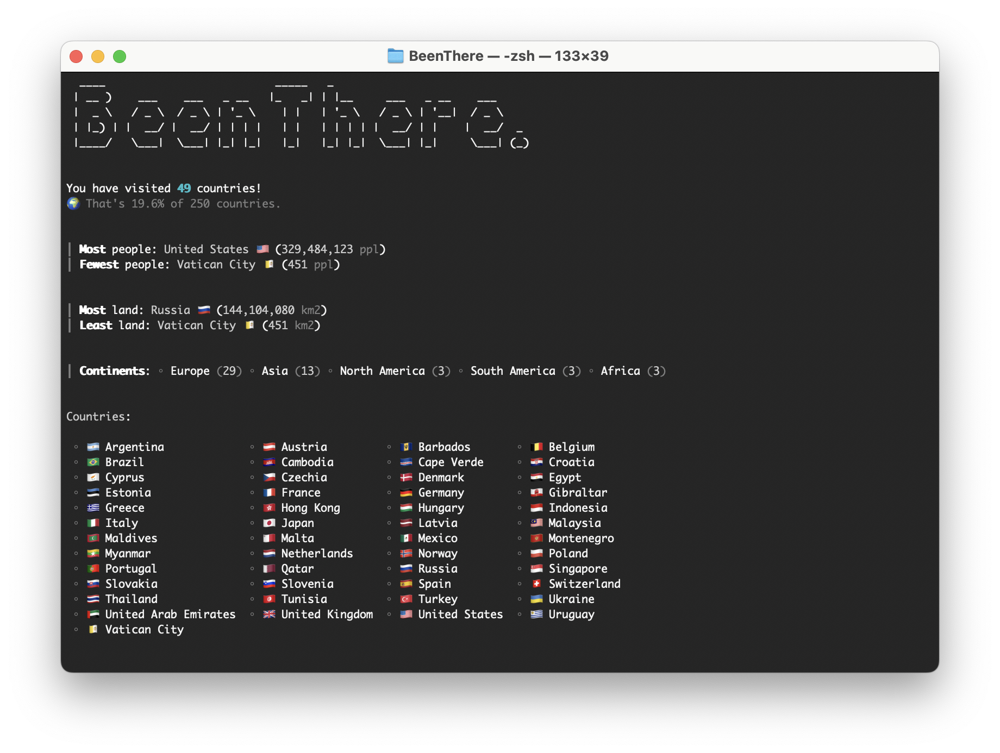
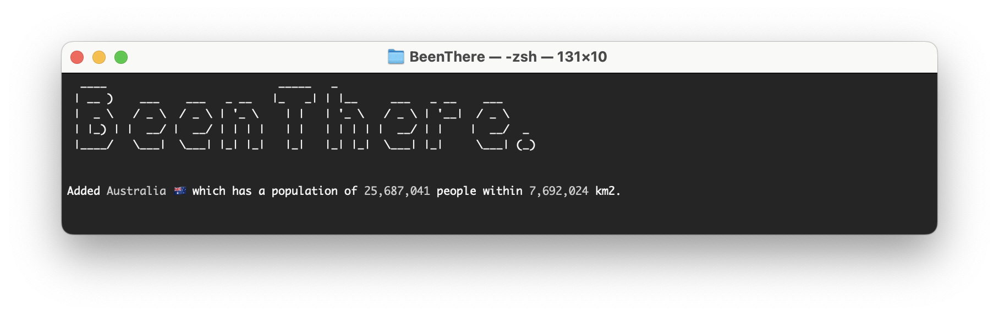

# BeenThere

> Terminal application for listing the countries you've visited with other interesting statistics thrown in

## Getting Started

Use the build in <kbd>./bin/been-there</kbd> or build your own from source using `make`.

You can use `./been-there` to display the help screen, and use the `add`, `remove`, `list` and `info` commands to manage the countries you've visited. Use `make test` to run the unit tests.

## Screenshots

